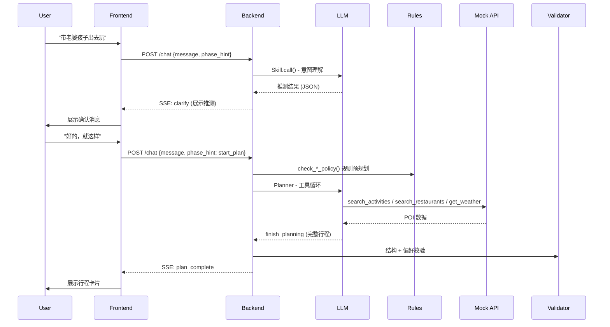

# 🧭 CHWL Agent — 本地生活短时活动规划与执行 Agent

<p align="center">
  <strong>把模糊出行意图，变成可执行的一站式本地生活方案</strong>
</p>

<p align="center">
  <a href="#"></a>
  <a href="#"></a>
  <a href="#"></a>
  <a href="#"></a>
  <a href="#"></a>
</p>

<p align="center">
  <a href="#-项目简介">项目简介</a> ·
  <a href="#-核心特性">核心特性</a> ·
  <a href="#-架构总览">架构总览</a> ·
  <a href="#-快速开始">快速开始</a> ·
  <a href="#-项目结构">项目结构</a> ·
  <a href="#-API-端点">API 端点</a> ·
  <a href="#-开发指南">开发指南</a>
</p>

---

## 📖 项目简介

**CHWL Agent** 是一个面向**本地生活短时出行**场景的 AI Agent，由美团 Hackathon 孵化。

用户只需用自然语言说一句需求（如*"带老婆孩子出去玩几个小时，别太远"*），Agent 就能自动完成从意图理解、POI 搜索、行程规划、预约履约到实时监控的**全链路闭环**。

### 一条语句，六个步骤

```
"带老婆孩子出去玩几个小时，别太远"
    │
    ├─ 1️⃣ 理解意图 → 解析场景、人数、时间、饮食偏好
    ├─ 2️⃣ 查询数据 → 并行获取活动、餐厅、天气、排队、路线
    ├─ 3️⃣ 规划行程 → LLM 评分排序 + 6 条合理性校验
    ├─ 4️⃣ 一键履约 → 并行取号、预约、模拟支付
    ├─ 5️⃣ 后台监控 → 7×24 盯排队、天气、预约余量变化
    └─ 6️⃣ 异常重规划 → 排队暴增/下雨/疲劳 → 自动调整 + 用户确认
```
## 🔗 作品链接

- 🎬 演示视频：
  - [ScreenApp 演示视频](https://screenapp.io/app/v/6szR0X9y_C)
  - [小红书演示视频](http://xhslink.com/o/16A1nVGziq7)

- 🚀 在线 Demo（已部署点击打开）：[CHWL Agent Demo](https://chwl-agent.vercel.app/)

- 📄 设计文档：[腾讯文档](https://docs.qq.com/doc/DRkxXcnh4dHBBR29D)

- 💻 GitHub 仓库：[orchidlemon/chwl-agent](https://github.com/orchidlemon/chwl-agent)
---

## 🚀 核心特性

### 🧠 LLM 驱动的多阶段对话

| 阶段 | 说明 |
|------|------|
| **Gathering（意图收集）** | 从自然语言推断出行关键信息：场景、人数、时间、偏好 |
| **Confirming（偏好确认）** | 向用户展示推测，处理指代消解，合并用户反馈 |
| **Planning（规划执行）** | 基于规则约束 + 工具调用，生成完整行程方案 |
| **Monitoring（行中监控）** | 后台监控 + 模拟器生成环境事件，主动推送告警 |
| **Replanning（异常重规划）** | 排队暴增 / 天气恶化 / 用户疲劳 → 自动调整方案 |

### 📐 严格的状态机

- **行程 7 态**：`init → draft → pending_confirm → executing → completed → needs_replan → cancelled`
- **节点 10 态**：`planned → processing → success → failed → soft_lock → completed_lock → user_pinned → ...`
- 非法跳转自动 fallback，不会让用户看到崩溃

### 🔧 工具调用 + 规则引擎

LLM 通过 `tools/server.py`（MCP Tool Server）分两阶段调用工具：

**规则预规划阶段（5 个规则工具，来自 `rules/`）：**
```
check_age_policy / check_food_policy / check_group_policy
/ check_time_policy / check_itinerary_structure
```

**规划主循环阶段（9 个数据工具）：**
```
search_activity → search_restaurant → search_alternative
→ check_weather → check_availability → check_queue → estimate_route
→ check_itinerary_structure → finish_planning
```

每个规则（年龄/饮食/团体/时间/行程结构）都是独立 Python 模块，经 `tools/server.py` 封装为 LLM 可调用工具，非 Prompt 硬编码。

### 🛡️ 输出安全层

- **输出校验器**：Pydantic schema 验证 + 3 次自动降级修复
- **JSON 修复器**：处理截断/单引号/多余的逗号/代码块包裹等常见 LLM 输出问题
- **反幻觉**：严格校验 poiId 是否来自工具返回的真实数据
- **Human-in-the-loop**：关键操作（资源锁定、行程替换）需用户确认，超时自动拒绝

### 🔔 后台实时监控

- 行程确认后自动启动 4 种 Watch：**队列变化 / 天气恶化 / 预约状态 / 余量预警**
- 超过阈值自动触发告警 → 发起用户确认请求 → 调用 replanner 生成替代方案
- 独立的 **LLM 模拟器**：模拟真实环境变化（排队突增、突降大雨），用于 Demo & 测试

### 🎨 全功能 Web UI

- React + Vite 构建，SSE 实时事件推送
- 行程卡片/监控面板/排队趋势图/用户画像
- 节点打卡/删除/替换/时间编辑
- 模拟器注入面板（测试用）

---

## 🏗️ 架构总览

```
┌─────────────────────────────────────────────────────────────┐
│                     Web UI (React + Vite)                    │
│                    Port 5173 · SSE 实时推送                   │
└──────────────────────────┬──────────────────────────────────┘
                           │ POST/GET/SSE
┌──────────────────────────▼──────────────────────────────────┐
│                FastAPI Backend · Port 8002                   │
│                                                              │
│  ┌─────────────┐  ┌────────────────┐  ┌─────────────────┐   │
│  │ Session     │  │ Orchestrator   │  │ Confirmation    │   │
│  │ Manager     │◄─┤  · run_chat    │  │ Gateway         │   │
│  │             │  │  · run_plan    │──┤  · request       │   │
│  │  · 会话隔离  │  │  · run_fulfill │  │  · resolve      │   │
│  │  · 阶段管理  │  │  · run_replan  │  │  · timeout      │   │
│  │  · 记忆存储  │  │  · run_checkin │  └─────────────────┘   │
│  │  · Sandbox   │  └────────┬───────┘                        │
│  └─────────────┘           │                                 │
│                             │                                 │
│  ┌──────────────────────────▼──────────────────────────────┐ │
│  │                    LLM Skills Layer                      │ │
│  │  · prompts/ (意图/偏好/规划/重规划/模拟器)               │ │
│  │  · skills.py (DeepSeek / Anthropic 双引擎)               │ │
│  │  · agent_tools.py (Function Calling 定义 + 执行)         │ │
│  └──────────────────────────┬──────────────────────────────┘ │
│                             │                                 │
│  ┌──────────────────────────▼──────────────────────────────┐ │
│  │                   Core Engine                            │ │
│  │  · state_machine.py    行程 + 节点 FSM                   │ │
│  │  · output_validator.py  JSON 校验 + 修复                 │ │
│  │  · models.py           Pydantic 数据模型                 │ │
│  │  · background_watch.py 后台监控引擎                      │ │
│  │  · state_writer.py     前端状态 JSON 文件管理            │ │
│  └──────────────────┬───────────────────────────────────────┘ │
│                     │                                         │
│  ┌──────────────────▼───────────────────────────────────────┐ │
│  │   Rules (独立规则模块, 非 Prompt 硬编码)                  │ │
│  │   age_policy / food_policy / group_policy               │ │
│  │   time_policy / itinerary_structure                     │ │
│  └──────────────────────────────────────────────────────────┘ │
└──────────────────────────┬──────────────────────────────────┘
                           │ HTTP
┌──────────────────────────▼──────────────────────────────────┐
│                Mock API · Port 8000                          │
│  · 15+ 家庭/朋友场景 POI  · 实时天气 & 排队状态              │
│  · 路线估算 · 预约状态 · 事件推送                           │
└─────────────────────────────────────────────────────────────┘
```

### 请求生命周期



---

## ⚡ 快速开始

### 环境要求

- **Python 3.9+**
- **Node.js 18+**（前端开发时需要）
- **LLM API Key**（DeepSeek 或 Anthropic）

### 1. 启动 Mock API（数据模拟层）

```bash
cd mock_api
pip install -r ../backend/requirements.txt   # 如果还没装依赖
python app.py
# → http://localhost:8000  模拟数据服务
```

Mock API 提供：15+ 北京朝阳区家庭/朋友场景 POI、实时天气变化、排队状态模拟、路线估算。

### 2. 配置环境变量

```bash
cd backend
cp .env.example .env
```

编辑 `.env`：

```ini
# LLM 提供商 (deepseek / anthropic / longcat)
LLM_PROVIDER=longcat

# DeepSeek
DEEPSEEK_API_KEY=sk-your-key-here
DEEPSEEK_BASE_URL=https://api.deepseek.com

# longcat
LONGCAT_API_KEY=
LONGCAT_BASE_URL=https://api.longcat.chat/openai

# 或使用 Anthropic
# LLM_PROVIDER=anthropic
# ANTHROPIC_API_KEY=sk-ant-your-key-here

PORT=8002
```

> 无 API Key 时系统会自动使用基于规则的关键词匹配回退方案，功能受限但核心流程可跑通。

### 3. 启动后端

```bash
cd backend
pip install -r requirements.txt
python -m uvicorn backend.main:app --host 0.0.0.0 --port 8002 --reload
# → http://localhost:8002
# → Swagger: http://localhost:8002/docs
```

### 4. 启动前端

```bash
cd frontend
npm install
npm run dev
# → http://localhost:5173
```

### 5. 一键启动（Windows）

```powershell
powershell -ExecutionPolicy Bypass -File .\start.ps1 [YOUR_API_KEY]
```

这将依次启动：Mock API (8000) → 后端 (8002) → 前端 (5173)

---

## 📁 项目结构

```
chwl-agent/
├── backend/                    # FastAPI 后端服务
│   ├── main.py                 # 应用入口 - 路由定义 + SSE 响应
│   ├── orchestrator.py         # 主编排器 - 对话/规划/履约/重规划流程
│   ├── session.py              # 会话管理 - 隔离/阶段/记忆/Sandbox
│   ├── models.py               # Pydantic 数据模型 + 前后端适配
│   ├── schemas.py              # 请求/响应 Pydantic Schema
│   ├── skills.py               # LLM skill 函数 - 支持 DeepSeek / Anthropic
│   ├── agent_tools.py          # LLM Function Calling 定义 + 执行器
│   ├── tools.py                # 工具层 - Mock API 调用 + 注册中心
│   ├── tool_registry.py        # 工具注册中心 - 重试/超时/熔断/缓存
│   ├── output_validator.py     # 输出校验器 - Schema 验证 + JSON 修复
│   ├── confirmation_gateway.py # 用户确认网关 - 超时自动拒绝
│   ├── background_watch.py     # 后台监控引擎 - 排队/天气/预约/余量
│   ├── state_machine.py        # 行程7态 + 节点10态 FSM
│   ├── state_writer.py         # 前端状态 JSON 文件管理
│   ├── prompts/                # LLM System Prompts
│   │   ├── base.py             # Butler 身份 + 通用输出约束
│   │   ├── clarify.py          # 意图理解 Prompt
│   │   ├── confirm.py          # 偏好确认 Prompt（含指代消解）
│   │   ├── planner.py          # 规划主循环 + 规则预规划 Prompt
│   │   ├── replanner.py        # 重规划 Prompt
│   │   └── simulator.py        # 环境模拟器 Prompt
│   ├── .env.example
│   └── requirements.txt
│
├── frontend/                   # React + Vite 前端
│   ├── src/
│   │   ├── ChatPage.jsx        # 主聊天页面 - SSE 事件驱动
│   │   ├── App.jsx             # 应用入口
│   │   ├── styles.css          # 全局样式
│   │   ├── api/
│   │   │   └── agentClient.js  # 后端 API 客户端
│   │   └── components/
│   │       ├── ChatMessage.jsx
│   │       ├── ChatInput.jsx
│   │       ├── ItineraryCards.jsx   # 行程卡片渲染
│   │       ├── ItinerarySheet.jsx   # 行程详情展示
│   │       ├── MonitorPanel.jsx     # 监控面板
│   │       ├── ProgressCard.jsx     # 进度卡片
│   │       ├── ShareModal.jsx       # 分享弹窗
│   │       ├── TransitBar.jsx       # 交通路线条
│   │       ├── UserProfilePanel.jsx # 用户画像面板
│   │       └── AppRedirectModal.jsx # 跳转弹窗
│   ├── index.html
│   ├── vite.config.js
│   └── package.json
│
├── mock_api/                   # 独立 Mock API 服务
│   ├── app.py                  # 零依赖 HTTP 服务器 (BaseHTTPRequestHandler)
│   ├── mock_data/
│   │   ├── poi_data.py         # 15+ 家庭/朋友场景 POI 数据
│   │   ├── route_data.py       # 路线数据
│   │   ├── citywalk_data.py    # Citywalk 路线
│   │   └── environment_state.py
│   ├── memory_store/
│   │   └── store.py
│   └── run_mock_api.ps1
│
├── rules/                      # 独立规则模块（非 Prompt 硬编码），经 tools/server.py 封装为 LLM 工具
│   ├── age_policy.py           # 年龄规则（儿童/老人约束）→ check_age_policy
│   ├── food_policy.py          # 饮食规则               → check_food_policy
│   ├── group_policy.py         # 团体规则               → check_group_policy
│   ├── time_policy.py          # 时间窗口规则            → check_time_policy
│   └── itinerary_structure.py  # 行程结构校验（6 条硬规则）→ check_itinerary_structure
│
├── tools/                      # MCP Tool Server — 统一暴露规则工具 + 数据工具给 LLM
│   ├── categories/             # 按类别实现的工具函数
│   │   ├── search.py           # Discovery: search_activity / search_restaurant / search_alternative
│   │   ├── routing.py          # Validation: estimate_route
│   │   ├── realtime.py         # Validation: get_queue_status / get_booking_status
│   │   ├── validation.py       # Validation: check_weather / check_availability / check_queue
│   │   ├── execution.py        # Execution: book_ticket / book_restaurant / share_plan
│   │   ├── monitoring.py       # Monitoring: watch_queue / watch_weather / watch_booking
│   │   ├── discovery.py        # 底层 POI 搜索实现
│   │   ├── environment.py      # 环境数据（天气/位置/事件）
│   │   └── fulfillment.py      # 履约执行封装
│   ├── server.py               # Tool Server 入口：schema 注册、分组获取、统一执行调度
│   └── defaults.py             # 工具默认参数
│
├── start.ps1                   # Windows 一键启动脚本
├── .gitignore
└── README.md
```

---

## 🌐 API 端点

后端启动后访问 `http://localhost:8002/docs` 查看完整 Swagger 文档。

### 核心接口

| 方法 | 路径 | 说明 |
|------|------|------|
| `POST` | `/agent/session` | 创建新会话 |
| `DELETE` | `/agent/{id}/reset` | 重置会话 |
| `GET` | `/agent/{id}/memory` | 获取会话记忆 |
| `POST` | `/agent/{id}/memory` | 更新会话记忆 |
| **`POST`** | **`/agent/{id}/chat`** | **主入口：阶段感知对话（SSE 流）** |
| `POST` | `/agent/{id}/plan` | 规划（SSE 流，legacy） |
| `POST` | `/agent/{id}/fulfill` | 履约（SSE 流） |
| `POST` | `/agent/{id}/exception/confirm` | 异常确认（SSE 流） |
| `POST` | `/agent/{id}/confirmation/resolve` | 用户确认决议 |
| `POST` | `/agent/{id}/node/action` | 节点操作（删除/固定） |
| `POST` | `/agent/{id}/node/replace` | 节点替换 |
| `POST` | `/agent/{id}/node/checkin` | 节点打卡 |
| `POST` | `/agent/{id}/node/update` | 节点时间更新 |
| `POST` | `/agent/{id}/report` | 用户反馈（累了/排队太久等） |
| `GET` | `/agent/{id}/state` | 前端完整状态 |
| `GET` | `/agent/{id}/state/itinerary` | 行程节点（局部刷新） |
| `GET` | `/agent/{id}/state/monitor` | 监控面板数据（轮询） |
| `GET` | `/agent/{id}/state/profile` | 用户画像 |
| `GET` | `/agent/{id}/monitor/state` | 实时监控状态（含排队趋势） |
| `POST` | `/agent/{id}/simulator/advance` | 模拟器推进 |
| `GET` | `/health` | 健康检查 |

### SSE 事件类型

`/chat` 和 `/plan` 接口通过 Server-Sent Events 推送以下事件：

| 事件类型 | 说明 | 包含字段 |
|----------|------|---------|
| `text` | 普通文本回复 | `content` |
| `typing` | 思考中指示器 | — |
| `clarify` | 展示推测，等待确认 | `inferred`, `confirm_message`, `missing_fields` |
| `confirm_result` | 偏好确认结果 | `session_facts`, `preferences`, `ready_to_plan` |
| `thinking` | LLM 推理步骤 (CoT) | `step` |
| `tool_call` | LLM 调用工具 | `tool`, `args`, `result` |
| `plan_progress` | 规划进度 | `step`, `detail`, `percent` |
| `plan_complete` | 行程方案完成 | `itinerary` (含节点列表) |
| `plan_failed` | 规划失败 | `reason` |
| `fulfill_progress` | 履约进度 | `node_id`, `status`, `progress` |
| `fulfill_complete` | 履约完成 | `summary` |
| `fulfill_failed` | 履约失败 | `node_id`, `reason` |
| `confirmation` | 需要用户确认 | `request_id`, `title`, `description`, `options` |
| `replan_complete` | 重规划完成 | `itinerary` |
| `error` | 错误事件 | `message` |
| `done` / `stream_end` | 流结束 | — |

---

## ⚙️ 环境变量

| 变量 | 说明 | 默认值 |
|------|------|--------|
| `LLM_PROVIDER` | LLM 提供商 (`deepseek` / `anthropic` / `longcat`) | `longcat` |
| `DEEPSEEK_API_KEY` | DeepSeek API 密钥 | — |
| `DEEPSEEK_BASE_URL` | DeepSeek API 地址 | `https://api.deepseek.com` |
| `ANTHROPIC_API_KEY` | Anthropic API 密钥 | — |
| `LONGCAT_API_KEY` | LongCat API 密钥 | — |
| `LONGCAT_BASE_URL` | LongCat API 地址 | — |
| `PORT` | 后端服务端口 | `8002` |
| `MOCK_API_URL` | Mock API 地址 | `http://127.0.0.1:8000` |

---

## 🧪 开发指南

### LLM Provider 支持

系统支持三种 LLM 引擎：

```python
# backend/skills.py
if provider == "anthropic":
    # 使用 Anthropic Claude API
elif provider == "deepseek":
    # 使用 DeepSeek Chat / Reasoner API
    # DeepSeek-reasoner 的 reasoning_content 直接作为 CoT 展示步骤
elif provider == "longcat":
    # 使用 LongCat API
```

切换方式：修改 `.env` 中的 `LLM_PROVIDER` 字段。

### 添加新规则

在 `rules/` 目录下创建新文件，遵循现有模式：

```python
# rules/my_policy.py
def check_my_policy(**kwargs) -> dict:
    """
    返回格式：
    {
        "constraints": [...],
        "hard_blocks": [...],
        "recommendations": [...],
        "missing_for_complete_check": [...],
        "questions_to_ask_user": [...]
    }
    """
    ...
```

然后在 `agent_tools.py` 中注册为新工具，或在 `planner.py` prompt 中引用。

### 添加新 POI

编辑 `mock_api/mock_data/poi_data.py`，按现有格式添加条目：

```python
{'poi_id': 'act_xxx_001',
 'type': 'activity',
 'scenario': 'family',
 'name': '新活动名称',
 'category': 'indoor_playground',
 'tags': ['室内', '亲子'],
 'business_hours': '10:00-21:00',
 'booking_required': False,
 ...}
```

### 前端的 SSE 接入

```javascript
// frontend/src/api/agentClient.js
const { streamChat } = await import('./api/agentClient')

streamChat(sessionId, "带老婆孩子出去玩", {
  phase_hint: 'start_plan',
  original_request: "带老婆孩子出去玩",
}, (event) => {
  switch (event.type) {
    case 'text':        // 显示文本消息
    case 'clarify':     // 展示推测，等待用户确认
    case 'plan_complete': // 渲染行程卡片
    case 'confirmation':  // 展示确认弹窗
    case 'fulfill_progress': // 更新履约进度
    case 'error':       // 显示错误
  }
})
```

---

## 🧩 设计原则

| 原则 | 说明 |
|------|------|
| **规则 ≠ Prompt** | 年龄/饮食/时间等规则是独立 Python 模块，不由 LLM 直接决策 |
| **状态机保护** | 所有阶段和节点状态迁移受 FSM 管控，非法跳转自动 fallback |
| **输出安全优先** | 三层校验：JSON 修复 → Schema 验证 → 业务规则验证 |
| **人机协同** | 关键操作必须经过用户确认网关，超时自动拒绝（fail closed） |
| **会话隔离** | 每个 Session 独立 Sandbox，互不干扰 |
| **可观测性** | 所有阶段变更、工具调用、事件都有日志和监控面板展示 |

---

## 🛣️ 路线图

- [x] 多阶段对话流程（Gathering → Planning → Monitoring）
- [x] 规则引擎（年龄/饮食/时间/团体/行程结构）
- [x] LLM Function Calling 工具调用
- [x] 后台排队/天气/预约监控
- [x] LLM 环境模拟器
- [x] 用户确认网关（含超时处理）
- [x] 状态机（行程 7 态 + 节点 10 态）
- [x] 输出校验 + JSON 自动修复
- [x] 全功能 React 前端
- [ ] 接入真实美团/大众点评 API
- [ ] 支付集成
- [ ] 多日行程规划
- [ ] 多人协作行程编辑

---

## 📄 License

MIT

---

## 🤝 贡献

本项目由美团 Hackathon 团队孵化。欢迎提交 Issue 和 PR！

> **注意：** 本项目的 Mock API 数据和 POI 信息仅用于技术演示和开发测试，不涉及真实商户数据。
